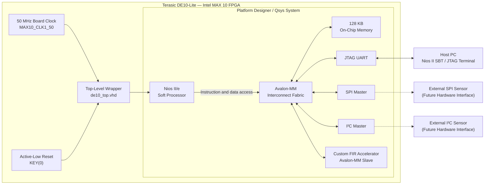

# Intel FPGA DE10 Embedded DSP & Measurement System

An end-to-end FPGA embedded system demonstrating hardware/software co-design using Intel Quartus Prime, Platform Designer (Qsys), Nios II, custom VHDL IP, MATLAB modelling and ModelSim verification.

The project implements a hardware-accelerated FIR filter connected to a Nios II soft processor through an Avalon Memory-Mapped (Avalon-MM) interface, representative of FPGA-based embedded architectures used in measurement, instrumentation, avionics, and real-time signal processing applications.

---

## Key Skills Demonstrated

- FPGA RTL Design (VHDL)
- Intel Platform Designer (Qsys)
- Avalon-MM Custom Peripheral Development
- Embedded Software Development (Nios II)
- Hardware/Software Co-design
- MATLAB DSP Modelling
- ModelSim Functional Verification
- Quartus Prime Synthesis & Timing Closure
- Memory-Mapped Embedded Systems
- Digital Signal Processing

---


# Project Highlights

✔ Custom VHDL FIR hardware accelerator

✔ Avalon-MM peripheral integration

✔ Intel Platform Designer (Qsys)

✔ Nios II Embedded Processor

✔ Embedded C firmware

✔ MATLAB DSP modelling

✔ ModelSim functional verification

✔ Quartus Prime synthesis & implementation

✔ Hardware/Software Co-design

---

# Hardware Platform

**FPGA Board**

- Terasic DE10-Lite
- Intel MAX 10 FPGA (10M50DAF484C7G)

**Development Tools**

- Intel Quartus Prime Lite 18.1
- Platform Designer (Qsys)
- Nios II SBT for Eclipse
- ModelSim Intel FPGA Edition
- MATLAB / GNU Octave

---

# System Architecture

The design combines a Nios II soft processor, on-chip program memory, standard communication peripherals and a custom VHDL FIR accelerator inside one Platform Designer subsystem.

The Nios II processor controls the measurement flow through the Avalon-MM interconnect. Raw samples are written to the custom FIR peripheral, processed in FPGA logic and read back by the embedded C application. Results are then sent to the host computer through the JTAG UART.




---


---

# Repository Structure

```
intel-fpga-de10-dsp-measurement

├── hardware/
│   ├── de10_top.vhd
│   ├── de10_top.qpf
│   ├── de10_top.qsf
│   ├── nios_system.qsys
│   ├── software/
│   └── ...
│
├── rtl/
│   ├── fir_filter.vhd
│   └── fir_filter_avalon.vhd
│
├── sim/
│   ├── fir_filter_tb.vhd
│   ├── compile.do
│   └── modelsim_waveform.png
│
├── mat/
│   ├── input_signal.txt
│   └── MATLAB scripts
│
└── README.md
```

---

# Project Workflow

## Phase 1: MATLAB DSP Design
A 4-tap Moving Average (Low-Pass) filter was chosen to clean a noisy low-frequency raw measurement telemetry data feed. 
*   The raw test wave signal was structured to integrate a continuous clean wave combined with highly volatile high-frequency signal interference.
*   Values were fully quantized into signed 8-bit fixed-point vectors (`-128` to `127`) to mirror identical physical constraints inside the digital logic fabric.
*   Test parameters were subsequently serialized into `mat/input_signal.txt` for integration into testbench environments.

---

## Phase 1 – DSP Algorithm Development

A 4-tap moving-average FIR filter was first designed and verified in MATLAB using fixed-point arithmetic.

The generated input vectors are exported for HDL simulation to guarantee identical test conditions between software and hardware.

---

## Phase 2 – RTL Design

The FIR filter was implemented in synthesizable VHDL.

Features:

- Fully synchronous design
- Shift-register pipeline
- Signed arithmetic
- Fixed-point implementation
- Vendor-independent RTL core

---

## Phase 3 – Functional Verification

The RTL was verified using ModelSim.

Verification includes:

- File-based stimulus
- 50 MHz clock
- Waveform inspection
- MATLAB comparison

The output waveform demonstrates successful suppression of high-frequency noise while preserving the desired low-frequency signal.


**Waveform Analysis:**
*   **`data_in` (Cyan Input):** Visualizes the highly distorted, jagged signal containing raw high-frequency fluctuations generated via MATLAB modeling.
*   **`data_out` (Green Output):** Displays a highly stable, uniform filtered sine wave. This demonstrates that the high-frequency variations have been successfully eliminated by the VHDL hardware block in real time.

---

---

## Phase 4 – FPGA Embedded System Integration

The FIR core is wrapped as a custom Avalon-MM peripheral and integrated into a complete Nios II embedded system using Intel Platform Designer.

System components include:

- Nios II/e processor
- 128 KB On-Chip RAM
- SPI Master
- I²C Master
- JTAG UART
- Custom FIR Hardware Accelerator

The embedded processor accesses the FIR through memory-mapped registers over the Avalon bus.


### Platform Designer Integration

The embedded subsystem was assembled using Intel Platform Designer (Qsys). During development, the complete hardware platform was validated through successful:

- Custom Avalon-MM IP packaging
- Address-space allocation
- Interrupt routing
- BSP generation
- Embedded software integration

The final design successfully generates the Platform Designer hardware description (`.sopcinfo`), enabling automatic Board Support Package (BSP) creation for the Nios II software environment.


---

# Embedded Software

A bare-metal Embedded C application performs:

1. Sensor data acquisition (simulated)
2. Writing samples to the FIR hardware accelerator
3. Reading filtered output
4. Sending results through JTAG UART

The software communicates with the hardware accelerator using standard Avalon memory-mapped register access:

- `IOWR_32DIRECT`
- `IORD_32DIRECT`

---

## Phase 5 – FPGA Implementation & Top-Level Integration

The complete Platform Designer system was integrated into the top-level FPGA design (`de10_top.vhd`), connecting the embedded processor subsystem with the physical resources of the DE10-Lite development board.

### Top-Level Hardware Connections

The design exposes the Nios II system to the FPGA pins through the top-level structural wrapper:

| FPGA Resource | Connected Signal |
|--------------|------------------|
| `MAX10_CLK1_50` | System clock (`clk_clk`) |
| `KEY(0)` | Active-low system reset (`reset_reset_n`) |

The Quartus Prime project was successfully synthesized, placed and routed without timing violations, generating the final FPGA configuration bitstream (`de10_top.sof`) for hardware deployment.

### Quartus Prime Compilation

- RTL Analysis & Synthesis ✔
- Fitter ✔
- Timing Analysis ✔
- Assembler ✔
- Programming File Generation (`de10_top.sof`) ✔


This confirms that the complete hardware platform—including the Nios II processor, Platform Designer subsystem, custom Avalon-MM FIR accelerator and peripheral interfaces—was successfully implemented on the Intel MAX 10 FPGA.

---


# Verification Status

| Item | Status |
|-------|--------|
| MATLAB Model | ✅ |
| VHDL RTL | ✅ |
| ModelSim Simulation | ✅ |
| Avalon-MM Wrapper | ✅ |
| Platform Designer Integration | ✅ |
| BSP Generation | ✅ |
| Embedded C Build | ✅ |
| Quartus Compilation | ✅ |
| FPGA Programming | tba |
| Hardware Validation | tba |

---

# Build Instructions

## RTL Simulation

```
cd sim
do compile.do
```

---

## FPGA Compilation

Open

```
hardware/de10_top.qpf
```

Compile using Quartus Prime.

---

## Embedded Software

1. Generate BSP
2. Build firmware
3. Download `.elf`
4. Execute through JTAG UART

---

# Future Improvements

- Hardware validation using the DE10-Lite board
- Real SPI sensor interface
- I²C sensor integration
- Interrupt-driven firmware
- DMA support
- Performance benchmarking
- Fixed-point coefficient optimization

---

# Engineering Skills Demonstrated

- FPGA Design (VHDL)
- Embedded Systems
- Hardware/Software Co-design
- Digital Signal Processing
- Avalon-MM Bus Integration
- Intel Platform Designer
- Nios II Embedded Development
- MATLAB Verification
- ModelSim Verification
- Quartus Prime FPGA Development

---

# License

MIT License


