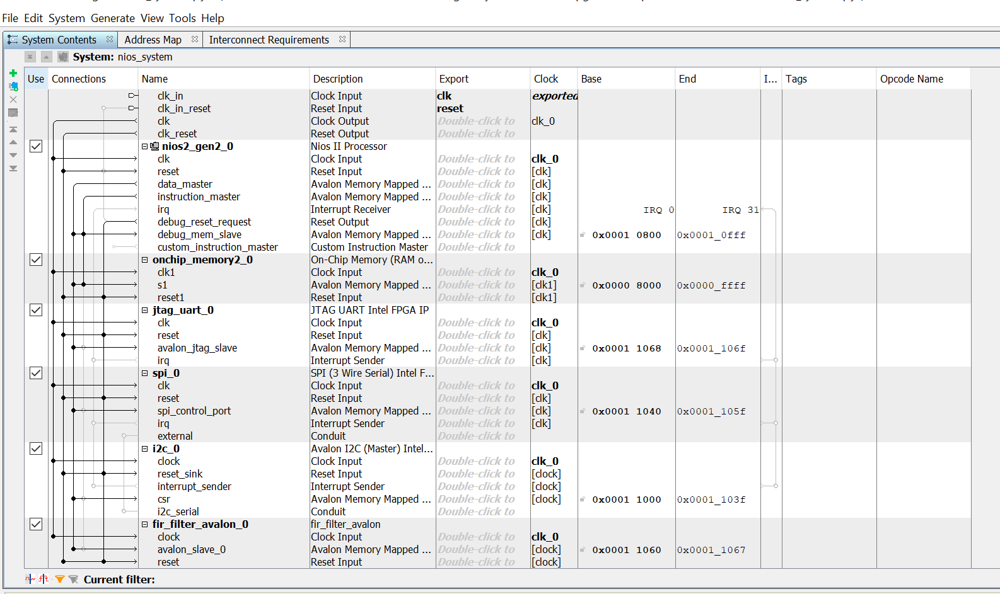
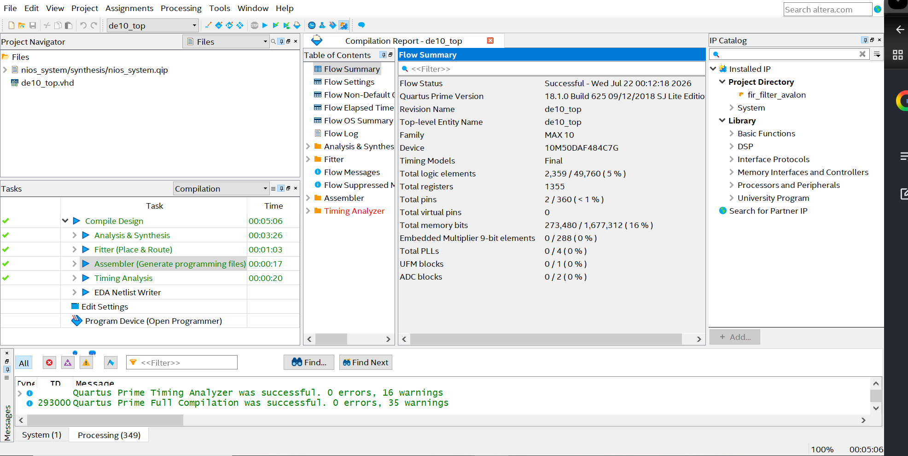

# Intel FPGA DE10 DSP & Measurement Gateway

This repository contains an end-to-end Signal Processing and Embedded Telemetry system designed for the Intel Cyclone V SoC platform (DE10). The architecture integrates custom VHDL hardware acceleration, MATLAB mathematical modeling, ModelSim verification, and a soft-core processor subsystem interconnected via the Avalon Memory-Mapped (Avalon-MM) bus fabric.

##  Project Overview & Architecture
This project addresses the core competencies required for high-reliability flight dsp and measurement systems:
*   **DSP Modeling & Verification:** Modeling noise-reduction filters and comparing implementation results directly against mathematical simulations.
*   **Hardware Acceleration:** High-speed parallel hardware pipelines executing real-time arithmetic calculations in a synthesizable VHDL structure.
*   **System-on-Chip (SoC) Integration:** Linking hardware modules with a microchip controller through standard vendor-agnostic system-level interconnect paths.

---

## Tools & Hardware Environment

### Software & Design Suites
*   **Design & Synthesis:** Intel Quartus Prime Light Edition (v18.1 or later)
*   **Verification & Simulation:** ModelSim - Intel FPGA Starter Edition
*   **Mathematical Modeling:** MATLAB / GNU Octave (Fixed-Point Scripting)
*   **Embedded Software Development:** Nios II Software Build Tools (SBT) for Eclipse

### Hardware Platforms
*   **Primary Deployment Target:** Terasic DE10-Lite / DE10-Standard (Intel Cyclone V SoC)
*   **Cross-Platform Heritage:** Originally optimized for vendor-independent deployment (compatible with Xilinx Vivado & Arty S7 Spartan-7 reference boards)

---

## Repository Structure
*   `mat/` — MATLAB verification modeling scripts and fixed-point input stimulation arrays.
*   `sim/` — ModelSim testbench infrastructure, simulation scripts, and visual verification plots.
*   `rtl/` — Fully synthesizable, vendor-independent VHDL logic processing blocks.
*   `hw/` — *[In Progress]* Quartus Prime hardware templates and Platform Designer (Qsys) systems.
*   `sw/` — *[In Progress]* Embedded C low-level control code and device integration firmware.

---

## Phase 1: MATLAB DSP Design
A 4-tap Moving Average (Low-Pass) filter was chosen to clean a noisy low-frequency raw measurement telemetry data feed. 
*   The raw test wave signal was structured to integrate a continuous clean wave combined with highly volatile high-frequency signal interference.
*   Values were fully quantized into signed 8-bit fixed-point vectors (`-128` to `127`) to mirror identical physical constraints inside the digital logic fabric.
*   Test parameters were subsequently serialized into `mat/input_signal.txt` for integration into testbench environments.

---

## Phase 2: VHDL Core Development & ModelSim Verification
The computational core was constructed using standard synthesizable IEEE VHDL libraries.

### Hardware Filtering Mechanics
The incoming byte stream transitions through a 4-cycle arithmetic delay chain pipeline. The aggregated results are processed concurrently and divided instantaneously using a zero-latency arithmetic right bit-shift configuration (`shift_right` by 2 bits).

### Simulation Results
The behavior of the synthesis block was tested within an file-I/O testbench driving at a 50 MHz clock speed (`20 ns` period). 

**Waveform Analysis:**
*   **`data_in` (Cyan Input):** Visualizes the highly distorted, jagged signal containing raw high-frequency fluctuations generated via MATLAB modeling.
*   **`data_out` (Green Output):** Displays a highly stable, uniform filtered sine wave. This demonstrates that the high-frequency variations have been successfully eliminated by the VHDL hardware block in real time.

---

---

## Phase 3: System-on-Chip (SoC) Integration via Avalon-MM

To interface the custom high-speed VHDL filter core with a soft-core processor environment, the DSP pipeline was wrapped inside an Intel Avalon Memory-Mapped (Avalon-MM) Slave peripheral structure. 

### Core System Infrastructure
An entire embedded processor system layout was assembled inside Intel Platform Designer (Qsys). The platform includes:
*   **Soft-Core Processor:** Nios II/e (Economy core) configured to run at 50 MHz.
*   **Volatile Memory Allocation:** 32 KB of On-Chip Dual-Port RAM configured for program code space and runtime variable caching.
*   **Telemetry Interfaces:** Full hardware integration of standard industrial flight buses, including a 1 MHz **SPI Master**, an **I2C Master**, and a **JTAG UART** for zero-extra-hardware data telemetry communications loops directly over the physical USB program cable link back to a PC console.

### Address Space Alignment
The system memory map was balanced to eliminate address boundaries arbitration overlap conflicts across the unified Avalon data matrix. The resulting structure registers are isolated into clean hex partitions:
*   `onchip_memory2_0.s1` ➔ `0x0000_8000` to `0x0000_FFFF`
*   `i2c_0.csr` ➔ `0x0001_1000` to `0x0001_103F`
*   `spi_0.spi_control_port` ➔ `0x0001_1040` to `0x0001_105F`
*   `jtag_uart_0.avalon_jtag_slave` ➔ `0x0001_1060` to `0x0001_1067`
*   `fir_filter_avalon_0.avalon_slave_0` ➔ `0x0001_1068` to `0x0001_106F`

---

##  Phase 4: Top-Level Hardware Packaging
The finalized Qsys system wrapper block was structurally linked inside a top-level structural design file (`hw/de10_top.vhd`). 

The hardware outer block directly routes the physical FPGA board resources down into the soft CPU fabric pins:
*   **`MAX10_CLK1_50` Pin** ➔ Routes the native physical crystal oscillator tracking speed straight into the global `clk_clk` line.
*   **`KEY(0)` Push-Button** ➔ Extends a physical active-low manual clear line directly into the system `reset_reset_n` core.

The Compilation was successful and it generated physical hardware programming bitstream file (de10_top.sof)

---

## Phase 5: Embedded C Software Architecture

A low-level, bare-metal C application was constructed inside the Nios II Software Build Tools (SBT) environment to drive the telemetry gateway system.

### Data Routing Mechanics
The control algorithm manages a serialized runtime schedule to capture sensor data streams, isolate volatile fluctuations, and dispatch clean values back to a PC host console:
1.  **Telemetry Capture:** Simulates high-reliability telemetry polling over the active 1 MHz SPI Master subsystem.
2.  **Hardware Acceleration:** Writes raw sensor values directly across the Avalon Memory-Mapped bus fabric into the custom `fir_filter_avalon_0` hardware registers using `IOWR_32DIRECT`.
3.  **Pipeline Synchronization:** Executes an embedded assembly fence instruction (`asm("nop")`) to guarantee that concurrent VHDL execution blocks finalize arithmetic calculations prior to a memory fetch.
4.  **Data Dispatch:** Reads the stabilized telemetry stream from the status registers using `IORD_32DIRECT` and routes the arrays over the JTAG UART link back to the host computer diagnostic terminal.

---

## Verification & System Run Instructions

### Prerequisites
*   Intel Quartus Prime Light Edition v18.1
*   ModelSim - Intel FPGA Starter Edition

### Execution Steps
1.  **Simulation & Verification:** Open ModelSim, change the working directory to `/sim`, and execute `do compile.do`. This compiles the file-I/O testbench and plots the raw vs. filtered waveforms using the Analog Waveform Viewer to visually prove noise-rejection logic.
2.  **Hardware Synthesis:** Open Quartus Prime, load `hardware/de10_top.qpf`, and trigger a **Full Compilation**. This passes the design through synthesis, placement-and-routing, and timing closure to output the physical programming bitstream (`de10_top.sof`).
3.  **Firmware Compilation:** Launch the Nios II Software Build Tools (Eclipse) targeting the `/software` directory. Import the `nios_system.sopcinfo` hardware description manifest to generate the Board Support Package (BSP), then run a project build to generate the final execution binary file (`.elf`).

