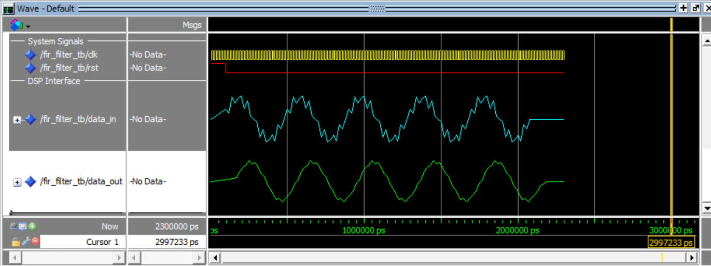

# Intel FPGA DE10 DSP & Measurement Gateway

This repository contains an end-to-end Signal Processing and Embedded Telemetry system designed for the Intel Cyclone V SoC platform (DE10). The architecture integrates custom VHDL hardware acceleration, MATLAB mathematical modeling, ModelSim verification, and a soft-core processor subsystem interconnected via the Avalon Memory-Mapped (Avalon-MM) bus fabric.

##  Project Overview & Architecture
This project addresses the core competencies required for high-reliability flight dsp and measurement systems:
*   **DSP Modeling & Verification:** Modeling noise-reduction filters and comparing implementation results directly against mathematical simulations.
*   **Hardware Acceleration:** High-speed parallel hardware pipelines executing real-time arithmetic calculations in a synthesizable VHDL structure.
*   **System-on-Chip (SoC) Integration:** Linking hardware modules with a microchip controller through standard vendor-agnostic system-level interconnect paths.

---

## Tools & Hardware Environment

### Software & Design Suites
*   **Design & Synthesis:** Intel Quartus Prime Light Edition (v18.1 or later)
*   **Verification & Simulation:** ModelSim - Intel FPGA Starter Edition
*   **Mathematical Modeling:** MATLAB / GNU Octave (Fixed-Point Scripting)
*   **Embedded Software Development:** Nios II Software Build Tools (SBT) for Eclipse

### Hardware Platforms
*   **Primary Deployment Target:** Terasic DE10-Lite / DE10-Standard (Intel Cyclone V SoC)
*   **Cross-Platform Heritage:** Originally optimized for vendor-independent deployment (compatible with Xilinx Vivado & Arty S7 Spartan-7 reference boards)

---

## Repository Structure
*   `mat/` — MATLAB verification modeling scripts and fixed-point input stimulation arrays.
*   `sim/` — ModelSim testbench infrastructure, simulation scripts, and visual verification plots.
*   `rtl/` — Fully synthesizable, vendor-independent VHDL logic processing blocks.
*   `hw/` — *[In Progress]* Quartus Prime hardware templates and Platform Designer (Qsys) systems.
*   `sw/` — *[In Progress]* Embedded C low-level control code and device integration firmware.

---

## Phase 1: MATLAB DSP Design
A 4-tap Moving Average (Low-Pass) filter was chosen to clean a noisy low-frequency raw measurement telemetry data feed. 
*   The raw test wave signal was structured to integrate a continuous clean wave combined with highly volatile high-frequency signal interference.
*   Values were fully quantized into signed 8-bit fixed-point vectors (`-128` to `127`) to mirror identical physical constraints inside the digital logic fabric.
*   Test parameters were subsequently serialized into `mat/input_signal.txt` for integration into testbench environments.

---

## Phase 2: VHDL Core Development & ModelSim Verification
The computational core was constructed using standard synthesizable IEEE VHDL libraries.

### Hardware Filtering Mechanics
The incoming byte stream transitions through a 4-cycle arithmetic delay chain pipeline. The aggregated results are processed concurrently and divided instantaneously using a zero-latency arithmetic right bit-shift configuration (`shift_right` by 2 bits).

### Simulation Results
The behavior of the synthesis block was tested within an file-I/O testbench driving at a 50 MHz clock speed (`20 ns` period). 

**Waveform Analysis:**
*   **`data_in` (Cyan Input):** Visualizes the highly distorted, jagged signal containing raw high-frequency fluctuations generated via MATLAB modeling.
*   **`data_out` (Green Output):** Displays a highly stable, uniform filtered sine wave. This demonstrates that the high-frequency variations have been successfully eliminated by the VHDL hardware block in real time.

---

## Upcoming Implementation Phases
*   **Phase 3:** Wrapping the VHDL filter core in an Avalon-MM peripheral module structure.
*   **Phase 4:** Compiling a complete Nios soft-core processor layout inside Intel Platform Designer.
*   **Phase 5:** Generating low-level system C driver logic loops communicating via local JTAG UART connection channels to a local host PC terminal.
